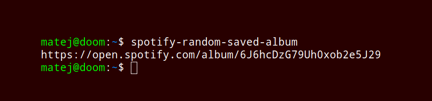

# 🍃 Spotify – get the URL of a random saved album

<p align="center">
	</img>
</p>

## Quick start
### 1. Install Python and pip
```
sudo apt install python3 python3-pip
```
### 2. Install the package
```
pip install spotify-random-saved-album
```
### 3. Run the script
```
spotify-random-saved-album 
```


## Usage

```
spotify-random-saved-album --h
usage: spotify-random-saved-album [-h] [--no-cache] [--update-cache] [--output-name] [--output-artist] [--uri]

options:
  -h, --help       show this help message and exit
  --no-cache       .cache.json won't be created
  --update-cache   force update cache file
  --output-name    append album's name to output
  --output-artist  append artist's name to output
  --uri            return URI instead of URL. You can pass URI to spotify.start_playback(context_uri=URI) to play the album instantly
                   (premium required)
```

## Run without installing the package – 7 steps:

1. Install dependencies and install the script:
	```
	sudo apt update
	sudo apt install git python3 python3-pip
	```
	```
	pip install spotify-random-saved-album
	```
	
2. https://developer.spotify.com/dashboard/applications – login and create a new Spotify Developer app	
	

3. Open created app on the Dashboard

4. Click `Edit settings` -> `Redirect URIs` -> add redirect URL `http://127.0.0.1:9090`
	

5. Copy `Client ID` and `Client Secret` from the app's main page
	

6. Create a new file `/path/to/.env` which will contain the Client ID and Client Secret:
		
	You can also create and populate `/path/to/.env` with the following commands:
	```bash
	touch .env # creates .env file
	echo "SPOTIFY_ID=<YOUR_CLIENT_ID>" >> .env
	echo "SPOTIFY_SECRET=<YOUR_CLIENT_SEC>" >> .env
	cat .env
	```
	
	The `.env` file should look like this:
	```
	SPOTIFY_ID=854c...
	SPOTIFY_SECRET=e85e...
	```


7. Get the URL of a random saved album:
   	
	(Option A) source the `/path/to/.env` (sets $SPOTIFY_ID and $SPOTIFY_SECRET) and run the `spotify-random-saved-album` command
	```python
	source /path/to/.env && spotify-random-saved-album
	```
	

	(Option B) the variables explicitly and run the script:
	```
	SPOTIFY_ID=<YOUR_CLIENT_ID> SPOTIFY_SECRET=<YOUR_CLIENT_SEC> spotify-random-saved-album
	```


### Notes

You have to pass the OAuth via browser once on last step.

Personal usecase of this script is to pipe the ouput (external link) to a browser command which will open a random album.
