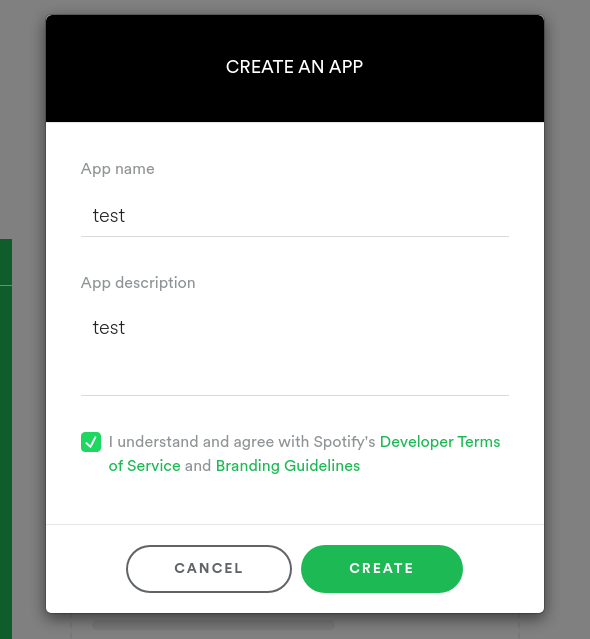
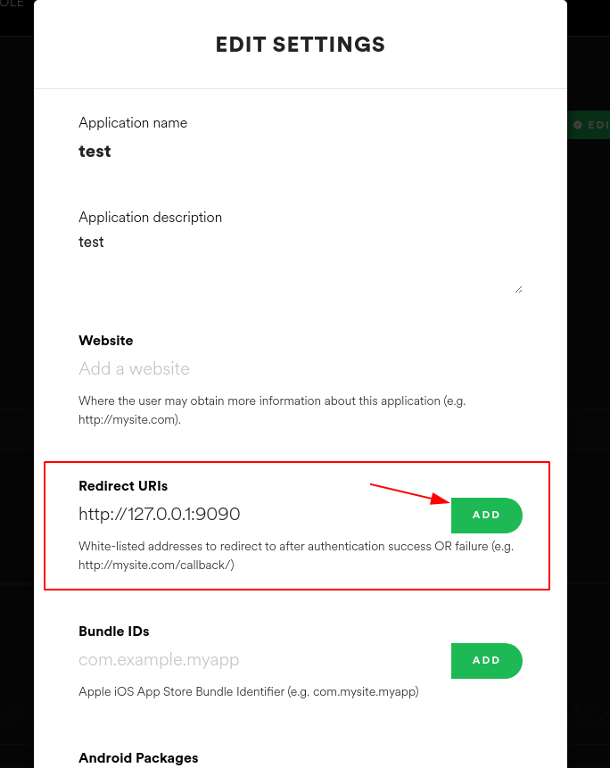
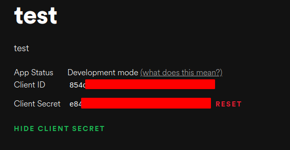

# 🍃 Spotify – get the URL of a random saved album

# Setup

1. Download the repo:
	```
	git clone https://github.com/matejciglenecki/spotify-random-saved-album.git
	cd spotify-random-saved-album
	```

2. Install dependencies:
	```sh
	pip install spotipy python-dotenv
	```
3. https://developer.spotify.com/dashboard/applications – login and create a new Spotify Developer app	
	

4. On the Dashboard open created app

5. Click `Edit settings` -> `Redirect URIs` -> add redirect URL `http://127.0.0.1:9090`
	

6. Copy `Client ID` and `Client Secret` from the app's main page
	

7. Create a new file `.env` at the same directory level as `src.py`
		
	replace `MY_CLIENT_ID` and `MY_CLIENT_SEC` with your values and append them to the `.env` file

	```bash
	touch .env # creates .env file
	echo "ID=MY_CLIENT_ID" >> .env
	echo "SEC=MY_CLIENT_SEC" >> .env
	cat .env
	```
	File `.env` should look like this:
	```
	ID=854c...
	SEC=e85e...
	```
8. Run `src.py` to get an external Spotify link to a random saved album
	```python
	python3 src.py
	```

You have to pass the OAuth via browser once on last step

Personal usecase is to pipe the ouput (external link) to a browser command which will open a random album
