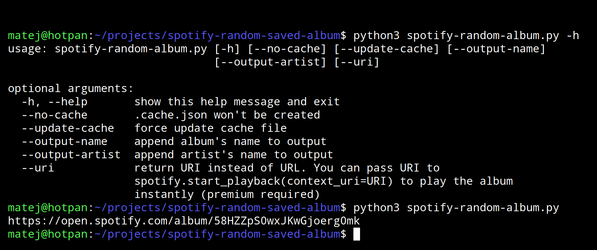
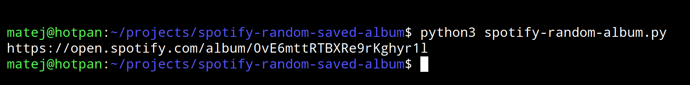

# 🍃 Spotify – get the URL of a random saved album

<p align="center">
	</img>
</p>

## Usage
```
python3 spotify-random-album.py [-h] [--no-cache] [--update-cache]
                               [--output-name] [--output-artist] [--uri]

optional arguments:
  -h, --help       show this help message and exit
  --no-cache       .cache.json won't be created
  --update-cache   force update cache file
  --output-name    append album's name to output
  --output-artist  append artist's name to output
  --uri            return URI instead of URL. You can pass URI to
                   spotify.start_playback(context_uri=URI) to play the album
                   instantly (premium required)
```

## Setup – 7 easy steps:

1. Install dependencies and clone the repository:
	```
	sudo apt update
	sudo apt install git python3-pip
	```
	```
	git clone https://github.com/matejciglenecki/spotify-random-saved-album.git
	cd spotify-random-saved-album
	pip install spotipy python-dotenv
	```
	
2. https://developer.spotify.com/dashboard/applications – login and create a new Spotify Developer app	
	

3. Open created app on the Dashboard

4. Click `Edit settings` -> `Redirect URIs` -> add redirect URL `http://127.0.0.1:9090`
	

5. Copy `Client ID` and `Client Secret` from the app's main page
	

6. Create a new file `.env` at the same directory level as `spotify-random-album.py`
		
	replace `MY_CLIENT_ID` and `MY_CLIENT_SEC` with your values and append them to the `.env` file
	
	You can also create and populate `.env` with the following commands:
	```bash
	touch .env # creates .env file
	echo "ID=MY_CLIENT_ID" >> .env
	echo "SEC=MY_CLIENT_SEC" >> .env
	cat .env
	```
	
	The `.env` file should look like this:
	```
	ID=854c...
	SEC=e85e...
	```


7. Run `spotify-random-album.py` to get an external Spotify link to a random saved album
	```python
	python3 spotify-random-album.py
	```
	

### Notes

You have to pass the OAuth via browser once on last step.

Personal usecase of this script is to pipe the ouput (external link) to a browser command which will open a random album.
